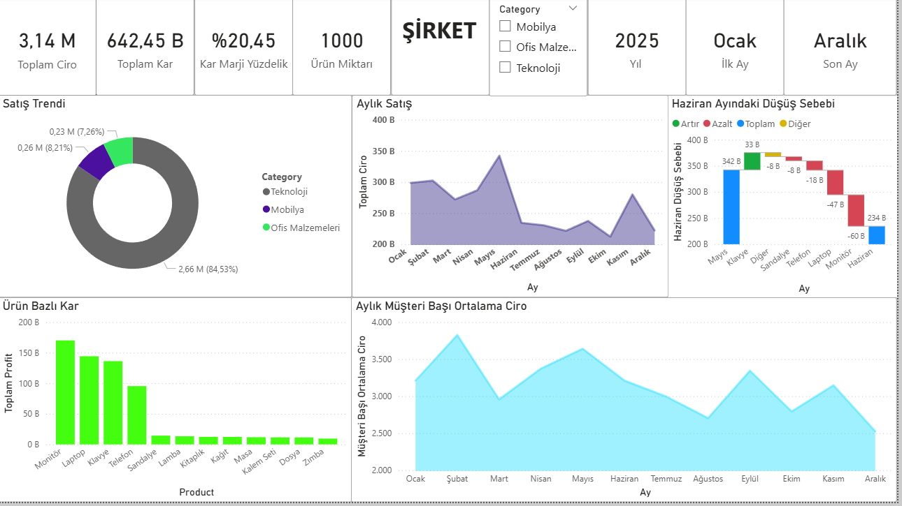

# 📊 Sales & Customer Performance Analytics: From Data Generation to Insight

Bu proje, Python kullanarak veri üretimiyle başlayan ve Power BI üzerinde görselleştirme ile tamamlanan bir veri analizi çalışmasıdır.

## 🛠️ Süreç Adımları

### 1. Veri Üretimi (Python & Faker)
Projenin temelinde yer alan 1000 satırlık satış verisi, Python'ın `pandas`, `faker` ve `random` kütüphaneleri kullanılarak özel olarak üretilmiştir. 
- **Teknik Detay:** Teknoloji, Mobilya ve Ofis Malzemeleri kategorilerinde gerçekçi fiyat ve kar marjı aralıkları tanımlanmıştır.
- **Dosya:** `Salesdata.py`

### 2. Veri Temizleme ve Modelleme (Power Query & DAX)
Üretilen veriler Power BI'a aktarılarak;
- Veri tipleri optimize edildi.
- **DAX Ölçüleri:** Müşteri başına düşen ortalama ciro (ARPU) ve dinamik kar marjı hesaplamaları oluşturuldu.
- **Zaman Serisi:** Tarih hiyerarşisi düzenlenerek yıllık/aylık trend analizine hazır hale getirildi.

### 3. Görsel Analiz ve AI Entegrasyonu
- **Kök Neden Analizi (Waterfall Chart):** Haziran ayındaki performans değişiminin hangi ürünlerden kaynaklandığı analiz edildi.
- **UX/UI Tasarımı:** Kullanıcı dostu, hizalı ve renk uyumlu bir dashboard arayüzü tasarlandı.

## 📈 Dashboard Görünümü

## 📂 Proje İçeriği
- `Salesdata.py`: Veriyi üreten Python scripti.
- `Sales_Performance_Data.csv`: Üretilen ham veri seti.
- `sonhal.pbix`: Power BI rapor dosyası.
